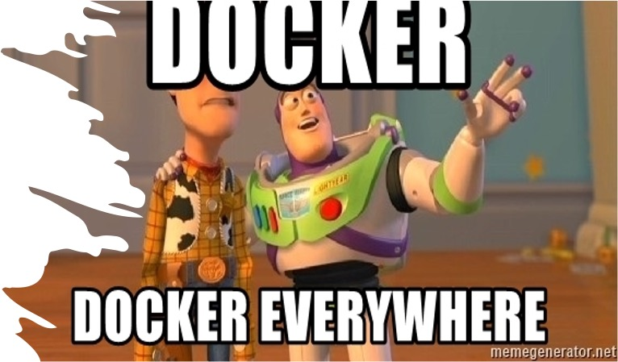
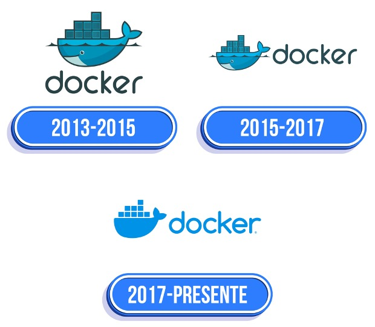
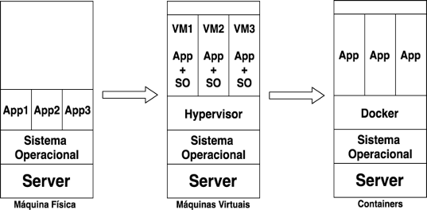
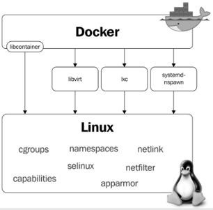

# **Docker containers**

## **Introdução**

<br>
Você já deve ter ouvido a famosa frase “na minha maquina não esta funcionando esse software”, e você testou na sua maquina e está funcionando normalmente e quando entra em contato com o usuário, identifica que na maquina dele está instalado uma versão de uma biblioteca incompatível com a que foi desenvolvida para o funcionamento da sua aplicação.
</br>
<br>
Talvez você sendo um administrador de sistemas e em todas as vezes que tem uma versão nova da aplicação, precisa atualizar todos os pacotes ou instalar outros novos em todo o seu parque de servidores para que o sistema funcione.
</br>
<br>
Se você precisa escalar o seu ambiente em questão de minutos para atender uma demanda temporária e provisionar novos servidores levará muito tempo e acaba travando uma força de venda que o departamento de vendas viu uma oportunidade para atuar.
</br>
<br>
Estas são apenas algumas das situações que ocorrem diariamente e o docker pode te auxiliar a resolvê-las.
</br>
</br>



</br>

## **O que é o Docker?**

Docker pode se referir a 3 pontos. Um dos pontos é relacionado a um projeto da comunidade open source; ele também pode estar vinculado a empresa Docker Inc., empresa que apoia o projeto; e Docker também pode estar vinculado às ferramentas da empresa Docker Inc..
Para conseguir compreender e diferenciar veja alguns pontos:

* O projeto open source Docker é onde a comunidade contribui gratuitamente para evolução da tecnologia;
* Docker Inc. é a empresa que se baseia no trabalho realizado pela comunidade e também realiza a contribuição para o projeto open source e depois oferece às empresas soluções enterprise e suporte;
* O software Docker é uma tecnologia da conteinerização para uso e criação de containers Linux.
  
Resumindo, o Docker é um projeto open source, desenvolvida na linguagem Go e criada pela empresa Docker Inc.
Containers Docker empacotam componentes de software em um sistema de arquivos completo, que contém tudo necessário para a execução: código, runtime, ferramentas de sistema - qualquer coisa que possa ser instalada em um servidor. Isto garante que o software sempre irá executar da mesma forma, independente do seu ambiente.
</br>

## **Um pocuo de história**


Em 2008 a empresa Solomon Hykes fundou a dotCloud onde tudo começou. A empresa era especializada em Platform-as-a-Service. Em 2013 a empresa toma a decisão de tornar o projeto core da plataforma open source e dessa forma nasceu o Docker.
Em pouco tempo o projeto foi evoluindo muito rápido com a contribuição de diversas pessoas ao redor do mundo.
Logo grandes empresas como AWS, Google ofereciam suporte a Docker em suas plataformas de nuvem.  Uma outra grande empresa começou a contribuir para a evolução do projeto e incorporou a solução em um dos seus principais produtos que foi a Red Hat incorporando ao Openshift.



</br>

## **O que é container?**

Veja algumas das definições sobre container:

* Container é um agrupamento de uma aplicação junto com as suas dependências, que compartilha o kernel do sistema operacional do host, ou de uma máquina virtual ou até mesmo física como o seu notebook. [Descomplicando Docker](https://livro.descomplicandodocker.com.br/chapters/chapter_01.html)
* Um [container Linux®](https://www.redhat.com/pt-br/topics/containers) é um conjunto de um ou mais processos organizados isoladamente do sistema. Todos os arquivos necessários para executá-los são disponibilizados por uma imagem distinta. Na prática, os containers Linux são portáteis e consistentes durante toda a migração entre os ambientes de desenvolvimento, teste e produção. 

Resumindo, o containers é aproximadamente análogo à VM. A principal diferença é que os containers não exigem seu próprio sistema operacional completo. Na verdade, todos os containers em um único host compartilham o sistema operacional do host. Isso libera grandes quantidades de recursos do sistema, como CPU, RAM e armazenamento. Ele também reduz os custos potenciais de licenciamento e reduz a sobrecarga de patches do sistema operacional e outras manutenções. Resultado líquido: economia nas frentes de tempo, recursos e capital. 

## **Funcionamento de um container**

Quando nós subimos uma máquina virtual utilizando um hypervisor como o virtual box ou o VMWare, nós emulamos um novo sistema operacional. Nesse processo é feito a virtualização do seu hardware utilizando todos os seus recursos disponíveis do host. A máquina virtual executa um sistema operacional completo, incluindo o kernel, exigindo mais recursos do sistema (CPU, memória e armazenamento).

Quando é utilizado um container, geralmente eles são enxutos, eles tendem a utilizar menos recursos que uma máquina virtual, ele executa a parte do modo de usuário de um sistema operacional e pode ser adaptado para conter apenas os serviços necessários para seu aplicativo, usando menos recursos do sistema.

Repare na figura a seguir, é possível identificar as diferenças entre uma máquina física, uma máquina virtual e containers.


[Descomplicando Docker](https://livro.descomplicandodocker.com.br/chapters/chapter_01.html
)
</br>

## **Docker Container**

Os containers do Docker são as instâncias em execução ao vivo de imagens do Docker. Embora as imagens do Docker sejam arquivos somente leitura, os containers são conteúdo dinâmico, efêmero e executável.

O Docker utiliza o modelo de contêiner para “empacotar” a aplicação que, após ser transformada em imagem Docker, pode ser reproduzida em plataforma de qualquer porte; ou seja, caso a aplicação funcione sem falhas em seu notebook, funcionará também no servidor ou no mainframe. Construa uma vez, execute onde quiser. 

Para criar o isolamento necessário do processo, o Docker usa a funcionalidade do kernel, denominada de namespaces, que cria ambientes isolados entre containers: os processos de uma aplicação em execução não terão acesso aos recursos de outra. A menos que seja expressamente liberado na configuração de cada ambiente. 

Para evitar a exaustão dos recursos da máquina por apenas um ambiente isolado, o Docker usa a funcionalidade cgroups do kernel, responsável por criar limites de uso do hardware à disposição. Com isso é possível coexistir no mesmo host diferentes containers sem que um afete diretamente o outro por uso exagerado dos recursos compartilhados.

A seguir temos um diagrama no qual é possível visualizar os módulos e features do kernel de que o Docker faz uso:




[Descomplicando Docker](https://livro.descomplicandodocker.com.br/chapters/chapter_02.html)

</br>

## **Existe alguma outra tecnologia semelhante ao Docker container?**

Respondendo diretamente, sim existem tecnologias semelhantes ao docker. Algumas delas:

* [Podman](https://podman.io/);
* [LXC (Linux Containers)](https://linuxcontainers.org/);
* [Containerd](https://containerd.io/).

</br>

## **Instalação do docker**

Instalação no Debian/Centos/Ubuntu/Suse/Fedora
```
# curl -fsSL https://get.docker.com/ | sh
```
Para identificar opções e boas práticas de instalação acesse o  [portal do docker](https://docs.docker.com/engine/install/)


Para realizar instalação em sistemas operacionais como Mac acesse o [portal do docker](https://docs.docker.com/desktop/mac/install/) para instalação do docker desktop.

Para desktops onde o Sistema operacional é Windows acesse o [portal do docker](https://docs.docker.com/desktop/windows/install/) para instalação desktop.

