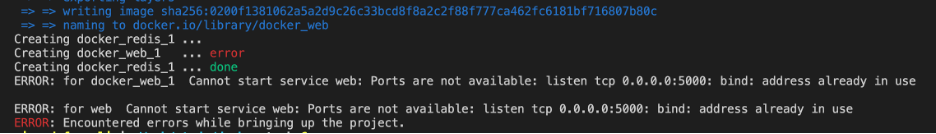

# **Docker Compose**

O Docker Compose nada mais é do que uma forma de você conseguir escrever em um único arquivo todos os detalhes do ambiente de sua aplicação. Antes nós usávamos o dockerfile apenas para criar imagens, seja da minha aplicação, do meu BD ou do meu webserver, mas sempre de forma unitária, pois tenho um dockerfile para cada "tipo" de container: um para a minha app, outro para o meu BD e assim por diante.

Com o Docker Compose nós falamos sobre o ambiente inteiro. Por exemplo, no Docker Compose nós definimos quais os services que desejamos criar e quais as características de cada service (quantidade de containers debaixo daquele service, volumes, network, secrets, etc.).

O padrão que os compose files seguem é o YML, supersimples e de fácil entendimento, porém sempre é bom ficar ligado na sintaxe que o padrão YML lhe impõe. ;)


O arquivo abaixo ilustra como é um arquivo do Docker Compose e como declaramos os serviços:

```
version: "3"
services:
  mysql:
    image: mysql:5.7
    volumes:
      - db_data:/var/lib/mysql
    environment:
      - MYSQL_ROOT_PASSWORD=wordpress
      - MYSQL_DATABASE=wordpress
      - MYSQL_USER=wordpress
      - MYSQL_PASSWORD=wordpress

  wordpress:
    depends_on:
      - mysql 
    image: wordpress:latest
    ports:
      - "8000:80"
    restart: always
    environment:
      WORDPRESS_DB_HOST: db:3306
      WORDPRESS_DB_USER: wordpress
      WORDPRESS_DB_PASSWORD: wordpress 
 
volumes:
   db_data:

```
Em resumo, utilizando o Docker Compose, em vez de o administrador executar o docker run na mão para cada container e subir os serviços separados, linkando os containers das aplicações manualmente, temos um único arquivo que vai fazer essa orquestração e vai subir os serviços/containers de uma só vez. Isso diminui a responsabilidade do Sysadmin ou do desenvolvedor de ter que gerenciar o deploy e se preocupar em rodar todos esses comandos para ter a sua aplicação rodando com todas as suas dependências.

Vamos conhecer algumas opções que utilizamos anteriormente:

* _version: \"3\"_ Versão do compose que estamos utilizando.
* _services:_ Início da definição de meu serviço.
* _mysql:_ Nome do serviço.
* _image: mysql:5.7_ Imagem que vamos utilizar.
* _volumes_ Neste caso estamos mapeando um volume.
* _restart_ Caso o container ocorra algum erro ele irá reiniciar.
* _environment:_ Passamos as variaveis de ambiente para iniciar o serviço.
* _ports: 8000:80_ Quais portas desejamos expor.

Para subir este serviço basta executar o comando:
```
# docker-compose up -d
```

Pronto, através de um comando subimos dois serviços. Isso é bem diferente de executar docker run para cada um dos serviços.

Para baixar todos os seus serviços que estão no docker compose basta alterar o _up_ para _down_.

```
# docker-compose down
```

____

**Docker compose build**

Quando estávamos baixando imagens e, em seguida, executando a imagem como um container, estávamos usando imagens que outras pessoas forneceram por meio do Docker Hub. Como criamos uma imagem Docker personalizada para nosso próprio uso utilizando o docker compose?

Para criar uma imagem personalizada que atenda aos nossos próprios requisitos, precisaremos construir uma imagem que contenha o que precisamos.

Este tutorial irá percorrer a construção de uma imagem Docker e, em seguida, explicar o que aconteceu.

Aqui estão as etapas que iremos tomar:

* atualize nosso arquivo docker-compose.yml existente para que ele crie uma imagem personalizada;
* adicionar instruções a um Dockerfile que o Docker Compose segue para construir uma nova imagem;
* use docker-compose build para construir nossa imagem personalizada;
* use docker-compose up para executar nossa imagem personalizada.

Vamos lá.

1 Vamos configurar o nosso ambiente.

1.1 A primera coisa que precisamos fazer é criar um pasta onde vai constar todos os nossos arquivos;

````
# mkdir composeteste
````

1.2 Vamos criar uma simples aplicação em python. Crie um arquivo chamado _app.py_ e insira o código abaixo:

```
import time

import redis
from flask import Flask

app = Flask(__name__)
cache = redis.Redis(host='redis', port=6379)

def get_hit_count():
    retries = 5
    while True:
        try:
            return cache.incr('hits')
        except redis.exceptions.ConnectionError as exc:
            if retries == 0:
                raise exc
            retries -= 1
            time.sleep(0.5)

@app.route('/')
def hello():
    count = get_hit_count()
    return 'Ola Mundo! Vezes de atualizacao da pagina {} times.\n'.format(count)
```

1.3 Crie um arquivo chamado requirements.txt e dentro dele insira as duas libs:

```
flask
redis
```

2 Vamos Criar nosso arquivo _Dockerfile_ e _docker-compose.yml_.

2.1 Crie um arquivo chamado _Dockerfile_ e insira o código abaixo:

```
# syntax=docker/dockerfile:1
FROM python:3.7-alpine
WORKDIR /code
ENV FLASK_APP=app.py
ENV FLASK_RUN_HOST=0.0.0.0
RUN apk add --no-cache gcc musl-dev linux-headers
COPY requirements.txt requirements.txt
RUN pip install -r requirements.txt
EXPOSE 5000
COPY . .
CMD ["flask", "run"]
```
Isso diz ao Docker para:

* Construa uma imagem começando com a imagem Python 3.7.
* Defina o diretório de trabalho como / code.
* Defina as variáveis de ambiente usadas pelo comando flask.
* Instale o gcc e outras dependências.
* Copie requirements.txt e instale as dependências do Python.
* Adicione metadados à imagem para descrever que o container está escutando na porta 5000.
* Copie o diretório atual. no projeto para o diretório de trabalho na imagem.
* Defina o comando padrão para o recipiente para execução de frasco.

2.2 Crie um arquivo com o nome _docker-compose.yml_, onde será definido os nossos services.

```
version: "3.9"
services:
  web:
    build: .
    ports:
      - "5000:5000"
  redis:
    image: "redis:alpine"
```
 Este docker-compose tem dois services, o nosso app e o redis.

 3 Vamos fazer o build do nosso app e subir os services.

 3.1 No diretório do seu projeto execute:

```
# docker-compose up --build .
```
Este comando irá fazer o build do seu app e subir os dois services.

3.2 Acesse através do seu navegador o endereço http://localhost:5000/ e veja a mensagem em seu navegador.

Como nos nao utilizando o parametro _-d_ ao apertar ctrl+c o seu container irá ser finalizado. Para que o seu app fique disponivel basta adicionar o parametro.

```
# docker-compose up --build -d
```


_Obs:_ Pode ocorrer de ao tentar subir os services apresentar o seguinte erro:



Isso pode ocorrer em situações que já tenha um outro serviço utilizando esta porta, ou então alguma configuração na sua rede do docker.

Para resolver de forma simples basta subistituir a linha _- "5000:5000"_ por _- "127.0.0.1:5000:5000"_ no seu docker-compose.yml e acessar o endereço http://127.0.0.1:5000 pelo seu navegador.

O comando docker-compose tem muitas possibilidades, execute no seu terminal o comando abaixo e veja as funcioes disponiveis.

```
# docker-compose --help
```


