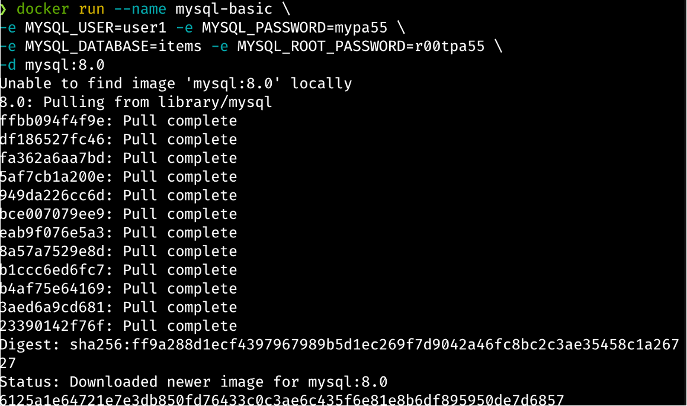
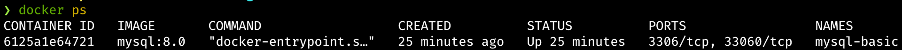
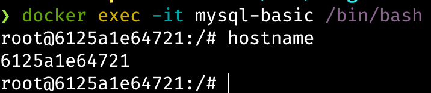
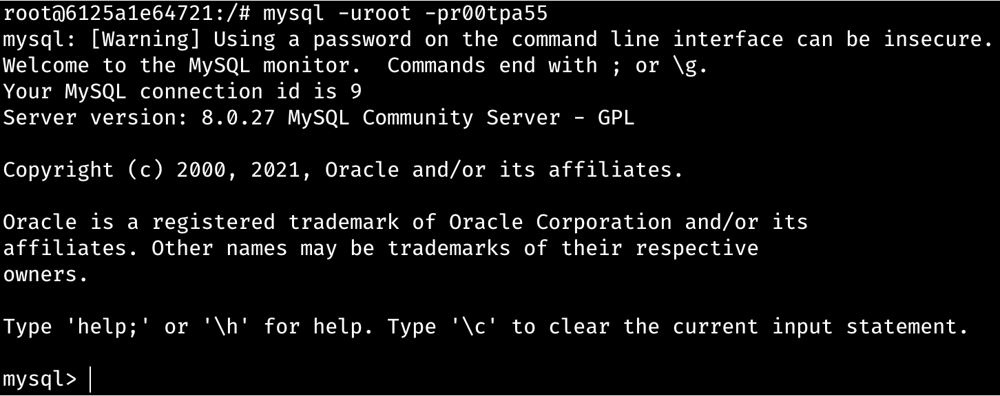
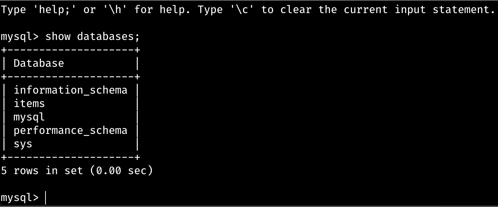
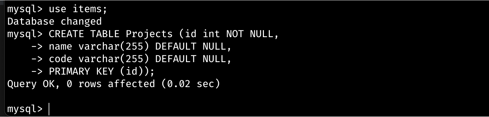
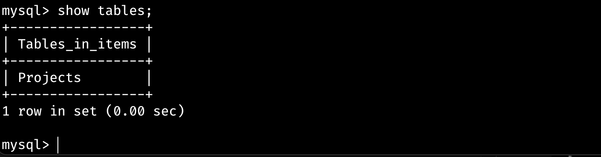
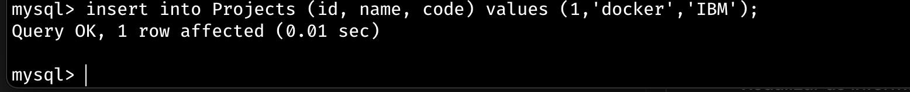
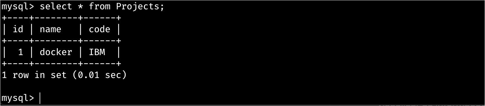
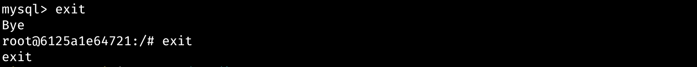

# Exercicios guiados

### 1 - Crie um container Mysql.
#### 1.1 Acesse o portal https://hub.docker.com e pesquise a imagem Mysql e vamos ver na documentação como inicializar o contianer. Para iniciar o nosso serviço com a imagem do Mysql, vamos inicia-lo com algumas variaveis: 

</br>MYSQL_ROOT_PASSWORD=r00tpa55 
</br>MYSQL_DATABASE=items
</br>MYSQL_USER=user1
</br>MYSQL_PASSWORD=mypa55

```
# docker run --name mysql-basic \
-e MYSQL_USER=user1 -e MYSQL_PASSWORD=mypa55 \
-e MYSQL_DATABASE=items -e MYSQL_ROOT_PASSWORD=r00tpa55 \
-d mysql:8.0
```



Vamos entender cada um dos itens do comando:

* _--name_ parâmetro que permite ser inserido um nome para o seu container. Neste exemplo o nome do nosso container será _mysql-basic_;
* _-e_ são as variáveis de ambiente que o container permite que o mysql já inicie com estas configurações. Neste exemplo o _MYSQL_USER_ e _MYSQL_PASSWORD_ estão passando o usuário e senha do banco de dados, o _MYSQL_DATABASE_ esta iniciando o nome da nossa database e o _MYSQL_ROOT_PASSWORD_ é a senha do administrador do banco;
* _-d_ ele indica ao Docker para iniciar o container em background (modo daemon);
* _mysql:8.0_ inidca a imagem que vamos utilizar e a tag que desejamos baixar. Neste exemplo estamos falando para o docker baixar a imagem mysql com a tag 8.0.
                                      
**Obs:Sempre que for necessário inicializar um container com variáveis de ambiente, como as inseridas no exemplo acima, é de extrema importância ver a documentação ou então identificar através do arquivo dockerfile quais as variáveis que o container suporta**
</br>
#### 1.2 Vamos verificar se o nosso container inicializou corretamente.
```
# docker ps
```


#### Com este comando conseguimos visualizar todos os containers em execução no nosso host no momento e para o nosso exemplo é um sinal de que tudo esta rodando perfeitamente.
</br>

#### 2 Vamos acessar o bash do nosso container que esta executando.

```
# docker exec -it mysql-basic /bin/bash
```



Vamos entender cada um dos itens do comando:

* _exec_ possibilita que seja possivel ser executado qualquer comando sem que seja preciso estar no console do container. O docker exec executara apenas se o container estiver running, caso contrario retonará uma mensagem de erro;
* _-it_ o -i modo interativo. Mantém o STDIN aberto mesmo sem console anexado e o -t ele aloca um pseudo TTY;
* _mysql-basic_ é o nome do container que vamos abrir o terminal para interagir dentro do container;
* _/bin/bash_ ele vai obter o shell (bash) do container.

**Obs:Alguns containers não suportam o /bin/bash, as alternativa para substituição são: sh; /bin/ash/**

</br>

### 3 Vamos aidcionar dados ao nosso banco de dados.
#### 3.1 Ainda dentro do container que executamos nos passos anteriores, vamos interagir com o nosso mysql e para isso precisamos utilizar o usuário e senha que passamos nas variaveis de ambiente quando iniciamos o container.

```
# mysql -uroot -pr00tpa55
```


O comando mysql abre o prompt interativo do banco de dados MySQL. 

Para visualizar todas as databases:
```
# show databases;
```


#### 3.2 Vamos criar uma tabela dentro da database items. Para conseguir criar uma tabel é preciso primeiro selecionar qual database vamos utilizar.

```
# use items;
```


#### 3.3 Vamos criar uma tablea chamada Projects.

```
CREATE TABLE Projects (id int NOT NULL,
name varchar(255) DEFAULT NULL,
code varchar(255) DEFAULT NULL,
PRIMARY KEY (id));
```


#### 3.4 Usar show tables para visualizar as tabelas existentes.

```
# show tables;
```


#### 3.5 Vamos inserir algumas informações na nossa tabela. E depois de criada, vamos então visualizar as informações dentro da tabela.

```
insert into Projects (id, name, code) values (1,'docker','IBM');
```


```
select * from Projects;
```



#### 3.6 Para sair do container basta digitar exit duas vezes e para finaliza-lo docker stop.

```
exit
```


Mesmo saindo do container ele ainda esta sendo executado.


Para finaiza-lo basta executar:

```
# docker stop mysql-basic
```


