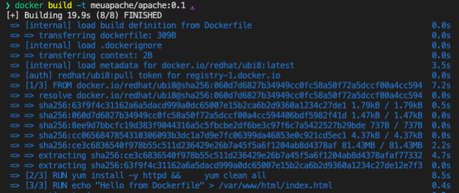
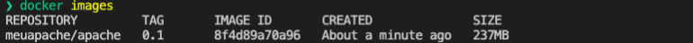
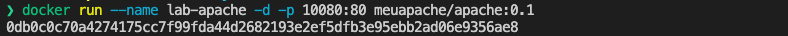
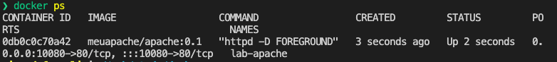
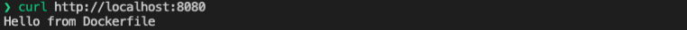
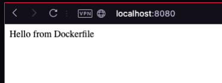
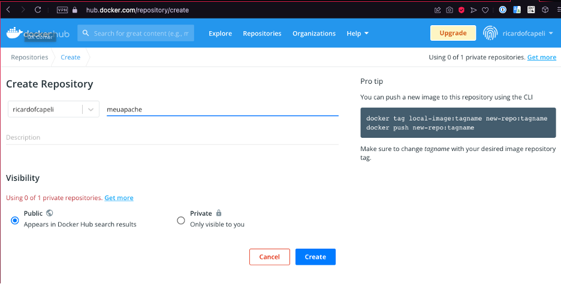
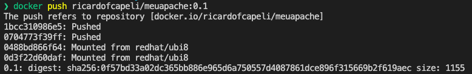
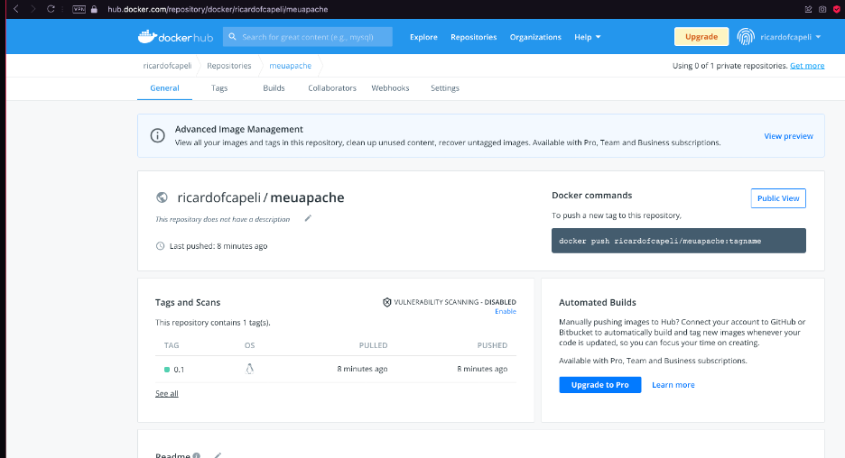

# Exercicios guiados

### 1 - Criação de uma imagem de container Apache básica.
#### 1.1 Crie um arquivo _Dockerfile_ com as seguintes informações: 

* Use o UBI latest como uma imagem de base adicionando a seguinte instrução FROM no topo do novo Containerfile.
  
```
FROM redhat/ubi8
```
* Abaixo da instrução FROM, inclua a instrução MAINTAINER para definir o campo Autor na nova imagem. Substitua os valores para incluir seu nome e endereço de e-mail.
  
```
MAINTAINER Your Name  <_youremail_>
```  
* Abaixo da instrução MAINTAINER, adicione a seguinte instrução LABEL para adicionar metadados de descrição à nova imagem: 

```
LABEL description="A custom Apache container based on UBI 8"
```

* Adicione uma instrução RUN com um comando yum install para instalar o Apache no novo container.

```
RUN yum install -y httpd && \
    yum clean all
```
* Add a RUN instruction to replace contents of the default HTTPD home page.

```
RUN echo "Hello from Dockerfile" > /var/www/html/index.html
```

* Use a instrução EXPOSE abaixo da instrução RUN para documentar a porta que o container escuta em tempo de execução. Neste caso, defina a porta para 80, porque é o padrão para um servidor Apache.

```
EXPOSE 80
```
* No final do arquivo, use a seguinte instrução CMD para definir httpd como o ponto de entrada padrão:

```
CMD ["httpd", "-D", "FOREGROUND"]
```

* O seu _Dockerfile_ deve ficar da seguinte maneira:

```
FROM redhat/ubi8
MAINTAINER Your Name  <_youremail_>
LABEL description="A custom Apache container based on UBI 8"
RUN yum install -y httpd && \
    yum clean all
RUN echo "Hello from Dockerfile" > /var/www/html/index.html
EXPOSE 80
CMD ["httpd", "-D", "FOREGROUND"]
```

#### 1.2 Crie e verifique a imagem do container Apache.

* Para gerar a nossa imagem vamos utilizar o comando _docker build_ e o parâmetro _-t_. 

```
# docker build -t meuapache/apache:0.1 .
```
Repare que quando utilizamos o parâmetro -t ele deve ser acompanhado pelo nome dado a nossa imagem.



* Apos o temrindo da geração da sua imagem, execute o comando docker images e verifique se a sua imagem esta disponivel.

```
# docker images
```


#### 1.3 Iniciando o nosso container.

* Para executar a nossa imagem basta executar:

```
# docker run --name lab-apache -d -p 8080:80 [nome da sua imagem gerada]
```

```
# docker run --name lab-apache -d -p 8080:80 meuapache/apache:0.1
```



* Para verificar se o container esta executando e testar o serviço basta executar:

```
# docker ps
```



Para testar, você pode executar o comando _curl_ ou pode acessar o endereço http://localhost:10080 usando o seu navegador.

```
# curl http://localhost:8080
```



Ou acesse pelo seu navegador:




#### 1.4 Enviar a sua imagem gerada para o repósitorio no docker hub.

* Pare o container que esta executando com o comando:
  
```
# docker stop lab-apache
```

* Para subir a sua imagem você precisa ter uma conta no [docker hub](https://hub.docker.com).

* Após criar a sua conta, crie um repositório para envio da sua imagem:



* Para enviar a nossa imagem primeiro precisamos colocar uma tag para o nosso repositório.

```
# docker tag meuapache/apache:0.1 ricardofcapeli/meuapache:0.1
```

```
# docker push ricardofcapeli/meuapache:0.1
```


* Acesse o portal docker hub e veja a imagem que você subiu.



Caso queira usar a sua imagem basta fazer o docker pull.