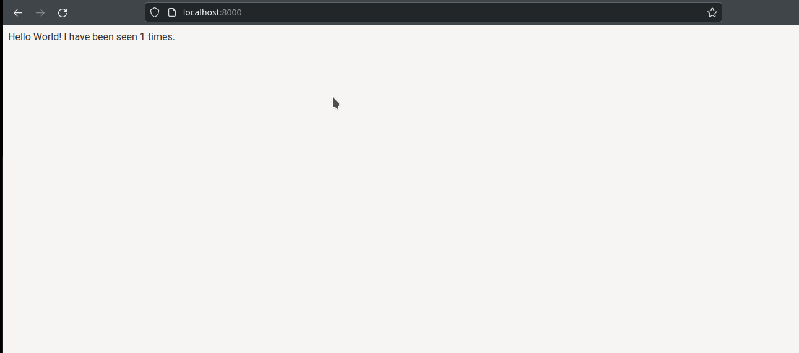

# Exercicio - O exercicio devera ser feito em duplas que serao escolhidas por mim.

### 1 Provisione uma aplicacao e persista os dados dela. Vamos utilizar neste exercicio o docker-compose.
* Crie uma pasta para conter a estutura do seu projeto;
* Neste exercicio vamos utilizar uma aplicacao em python e um redis;
* Crie um arquivo chamado app.py e nele insira o codigo abaixo:
```
import time

import redis
from flask import Flask

app = Flask(__name__)
cache = redis.Redis(host='redis', port=6379)

def get_hit_count():
    retries = 5
    while True:
        try:
            return cache.incr('hits')
        except redis.exceptions.ConnectionError as exc:
            if retries == 0:
                raise exc
            retries -= 1
            time.sleep(0.5)

@app.route('/')
def hello():
    count = get_hit_count()
    return 'Hello World! I have been seen {} times.\n'.format(count)

```
Arquivo requirements.txt

```
flask
redis
```

* Crie um arquivo Dockerfile e nele voce ira utilizar a seguinte estrutura:

```
# syntax=docker/dockerfile:1
FROM "selecione a imagem que ira utilizar do python"
WORKDIR "Insira o diretorio que sera criado dentro do container"
ENV FLASK_APP=app.py
ENV FLASK_RUN_HOST=0.0.0.0
RUN apk add --no-cache gcc musl-dev linux-headers
COPY requirements.txt requirements.txt
RUN "insira o comando que deve ser utilizado para instalar as dependencias que estao contidas no arquivo requirements.txt"
EXPOSE 5000
COPY . .
CMD ["flask", "run"]
```

* Crie um arquivo docker-compose.yml. Nele voce deve ter a estrutura para que seja feita o build da sua aplicacao e suba junto uma outra aplicacao que o redis;

* Para facilitar segue a estrutura inicial do docker-compose. Voce precisa inserir os itens faltantes:

```
version: 
services:
  web:

    ports:
      - "8000:5000"
  redis:
    image: 
    ports:
      - '6379:6379'

    volumes: 
      - ./cache:/data
volumes:
  cache:
    driver: local
```

* Fique bem atento pois estao faltando varias declaracoes para que suba a sua aplicacao em python e o redis que devem serem executados. Repare que existe uma declaracao de volume. Isso significa que os dados do redis serao armazenados e mesmo que o container se encerre os dados nao serao perdidos;

* Apos a construcao do arquivo, execute o comando necessario para que realize o build da aplicacao e entao suba os dois servicos;

* O resultado final deve ser semelhante ao abaixo:



* Repare que a cada refresh no seu navegador o numero e modificado;

* Execute o comando para baixar os dois servicos e entao suba novamente o docker-compose e veja se o numero permanece o mesmo ou ele inicia a partir do 1. Se iniciar a partir do 1 ele estara errado. E necessario rever a parte do volume do seu docker-compose.


