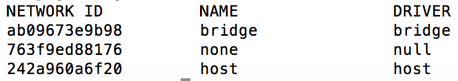
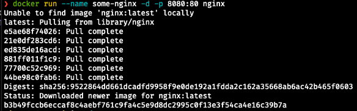
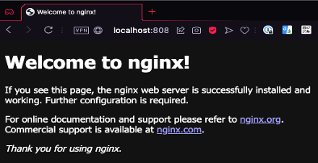

# Padrões de redes do Docker

O docker provisiona por padrão 3 redes. Cada uma destas redes é criada para configurações específicas na comunicação e tráfego de rede entre os containers e seu host. Para visualizar as interfaces de rede, basta executar o comando:

```
# docker network ls
```


**_Bridge_**

Cada container iniciado no docker é associado a uma rede especifica, e essa é a rede padrão para qualquer container que não foi explicitamente especificado.

Os containers configurados para essa rede terão a possibilidade de trafego externo, utilizando as rotas das redes IP definidas no docker host, ou seja, caso o docker host tenha acesso a internet, automaticamente os containers em questão também terão.

Nessa rede é possível expor portas dos containers para todos os ativos que conseguem acessar o docker host.

**_None_**

Essa rede tem como objetivo isolar o container para comunicações externas, ou seja, ela não receberá nenhuma interface para comunicação externa. A sua única interface de rede IP será a localhost.

Essa rede normalmente é utilizada para containers que manipulam apenas arquivos, sem a necessidade de enviá-los via rede para outro local. (Ex. container de backup que utiliza os volumes de container de banco de dados para realizar o dump, que será usado no processo de retenção dos dados).


**_Host_**

Essa rede tem como objetivo entregar para o container todas as interfaces existentes no docker host. De certa forma isso pode agilizar a entrega dos pacotes, uma vez que não há bridge no caminho das mensagens, mas normalmente esse overhead é mínimo e o uso de uma brigde pode ser importante para segurança e gerencia do seu tráfego.

O docker possibilita que sejam criadas redes pelo usuário, essas redes são associadas ao que docker chama de driver de rede.

Cada rede criada por usuário deve estar associado a um determinado driver, e caso você não crie seu próprio driver, você deve escolher entre os drivers disponibilizados pelo docker.

Para exemplificar a utilização de uma rede criada por usuário, primeiro vamos criar a rede chamada _rede_docker_ com o driver bridge:

```
# docker network create --driver bridge rede_docker
```
Agora vamos verificar a rede que acabamos de criar:

```
# docker network ls
```
Para descobrir quais containers estão associados a uma determinada rede, execute o comando abaixo:
```
# docker network inspect rede_docker
```

**_Overlay_**

Esse driver permite comunicação entre hosts docker, ou seja, com sua utilização os containers de um determinado host docker poderão acessar nativamente containers de um outro ambiente docker.

Para um maior detalhamento acesse o [portal do docker](https://docs.docker.com/network/). 

# Mapeando portas de rede

É possível mapear tanto portas TCP como UDP diretamente para o host, permitindo acesso através de toda a rede, não necessitando ser a mesma porta do container. 

O método mais comum para este fim é o parâmetro _-p_ no comando _docker run_, o _-p_ recebe um parâmetro que normalmente é
composto por dois números separados por _: (dois pontos)_. O primeiro é no host e o segundo é no
container.

Vejamos um exemplo:

```
# docker run --name some-nginx -d -p 8080:80 nginx
```


Vamos para a explicação de cada parâmetro inserido no comando:

* _--name_ ele permite que você escolha qualquer nome para o seu container, neste caso estamos usando _some-nginx_, mas você pode colocar qualquer outro;
* _-d_ permite que o seu container continue sendo executado em background;
* _-p_ realiza o mapemando de porta. Neste exemplo estamos realizando um redirecionamento da porta 8080 para 80 dentro do container;
* _nginx_ é a imagem que desejamos que seja executada.

Estes parâmetros a própria documentação disponivel no docker hub, por este motivo sempre leia o que a documentação oferece.

Para verificar se o seu container está executando com sucesso, acesse  através do seu navegador o endereço http://localhost:8080 a página deve ser semelhante a imagem abaixo.



